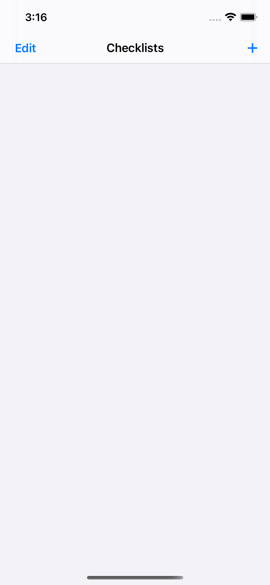
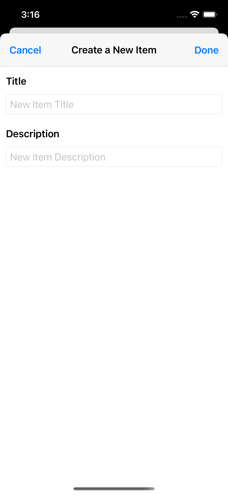
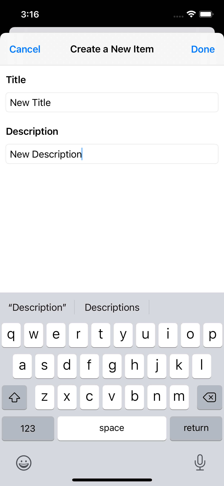
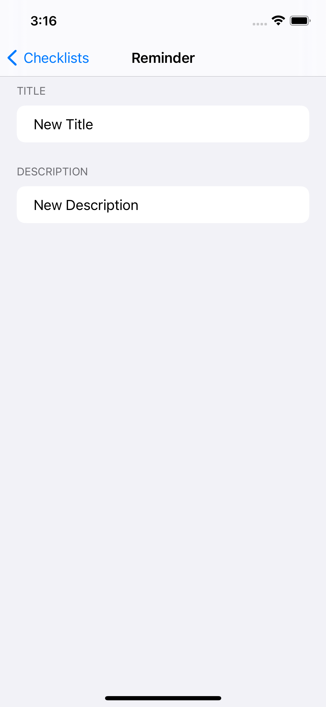
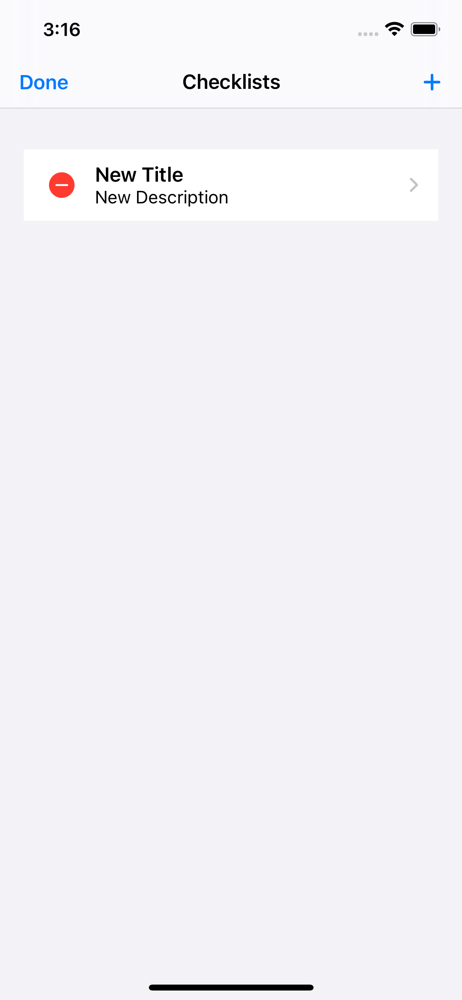

## Checklists

Simple iOS reminders app written in SwiftUI. This project was worked on during January and February 2020.

This project was never completed, but it served as a nice way to learn the basics of SwiftUI and CoreData.

The current features of the application include creating a reminder with a title and description, as well as editing that title and description.

